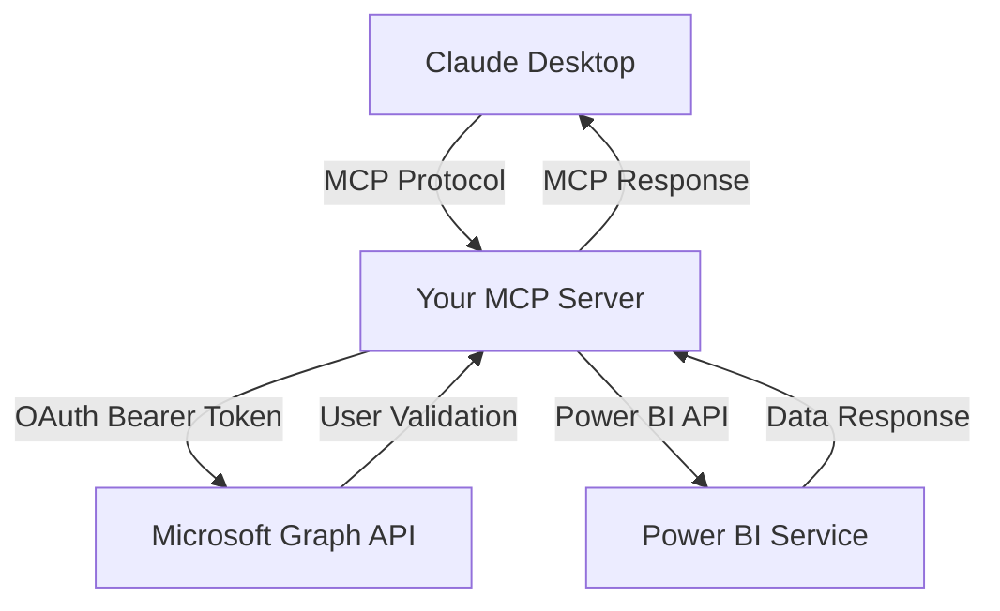
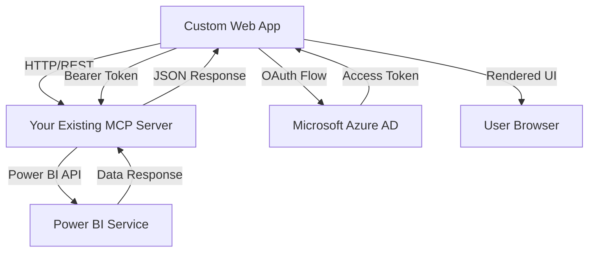

# 🌐 Building a Custom Website to Interact with Your MCP Server
## Complete Implementation Guide

### 📋 Table of Contents
1. [Project Overview](#project-overview)
2. [Architecture Analysis](#architecture-analysis)
3. [Technology Stack](#technology-stack)
4. [Implementation Phases](#implementation-phases)
5. [Authentication & Security](#authentication--security)
6. [Frontend Development](#frontend-development)
7. [Backend Communication](#backend-communication)
8. [UI/UX Design](#uiux-design)
9. [Deployment Strategy](#deployment-strategy)
10. [Testing & Quality Assurance](#testing--quality-assurance)

---

## 🎯 Project Overview

### What We're Building
A custom web application that replicates Claude Desktop's functionality for interacting with your Power BI MCP server. This will be a full-stack web application that:

- ✅ Authenticates users via Microsoft OAuth 2.0
- ✅ Communicates with your MCP server at `https://pbimcp.azurewebsites.net`
- ✅ Provides a chat-like interface similar to Claude Desktop
- ✅ Executes MCP tools (workspaces, datasets, DAX queries)
- ✅ Displays Power BI data in user-friendly formats
- ✅ Works seamlessly across devices (responsive design)

### Current State Analysis
Your existing MCP server (`app.py`) provides:
- **OAuth 2.0 Authentication**: Microsoft Azure AD integration
- **5 MCP Tools**: 
  - `get_powerbi_status()` - Authentication status
  - `health_check()` - Server health
  - `list_powerbi_workspaces()` - List accessible workspaces
  - `get_powerbi_datasets()` - Get datasets from workspaces
  - `execute_powerbi_query()` - Execute DAX queries
- **REST API Endpoints**: HTTP endpoints for all tools
- **Multi-tenant Support**: User-specific access with delegated permissions

---

## 🏗️ Architecture Analysis

### Current MCP Server Architecture


### Proposed Custom Website Architecture


### Key Differences from Claude Desktop
| Aspect | Claude Desktop | Your Custom Website |
|--------|----------------|-------------------|
| **Protocol** | MCP over stdio/SSE | HTTP REST API |
| **Interface** | Native desktop app | Web browser |
| **Authentication** | Built-in OAuth flow | Custom OAuth implementation |
| **Data Display** | Text-based responses | Rich HTML/JavaScript UI |
| **User Experience** | AI chat interface | Custom dashboard/chat hybrid |

---

## 🛠️ Technology Stack

### Frontend Technologies
```json
{
  "framework": "React 18 with TypeScript",
  "ui_library": "Material-UI (MUI) or Chakra UI",
  "state_management": "React Query + Zustand",
  "authentication": "Microsoft Authentication Library (MSAL.js)",
  "http_client": "Axios with interceptors",
  "styling": "Tailwind CSS + styled-components",
  "charts": "Chart.js or D3.js for Power BI data visualization",
  "real_time": "WebSocket or Server-Sent Events (optional)"
}
```

### Backend Technologies (Optional - you can use existing MCP server)
```json
{
  "option_1": "Use existing Flask MCP server directly",
  "option_2": "Add Next.js API routes as middleware",
  "option_3": "Create separate Node.js/Express backend"
}
```

### Development Tools
```json
{
  "bundler": "Vite or Next.js",
  "testing": "Jest + React Testing Library",
  "e2e_testing": "Playwright or Cypress",
  "linting": "ESLint + Prettier",
  "deployment": "Vercel, Netlify, or Azure Static Web Apps"
}
```

---

## 📋 Implementation Phases

### Phase 1: Foundation Setup (Week 1)
```bash
# 🎯 Goals: Basic project structure and authentication
✅ Initialize React TypeScript project
✅ Set up MSAL.js authentication
✅ Create basic routing structure
✅ Implement OAuth flow with your MCP server
✅ Test connection to https://pbimcp.azurewebsites.net
```

### Phase 2: Core MCP Integration (Week 2)
```bash
# 🎯 Goals: Connect to all MCP tools
✅ Create API service layer for MCP communication
✅ Implement tool execution functions
✅ Add error handling and loading states
✅ Create data models for MCP responses
✅ Test all 5 MCP tools integration
```

### Phase 3: User Interface Development (Week 3)
```bash
# 🎯 Goals: Build intuitive user interface
✅ Design and implement dashboard layout
✅ Create chat-like interface for tool interactions
✅ Add Power BI data visualization components
✅ Implement responsive design
✅ Add accessibility features
```

### Phase 4: Advanced Features (Week 4)
```bash
# 🎯 Goals: Polish and advanced functionality
✅ Add real-time updates (WebSocket/SSE)
✅ Implement data caching and optimization
✅ Add user preferences and settings
✅ Create advanced filtering and search
✅ Performance optimization
```

### Phase 5: Testing & Deployment (Week 5)
```bash
# 🎯 Goals: Production-ready deployment
✅ Comprehensive testing (unit, integration, e2e)
✅ Security audit and hardening
✅ Performance testing and optimization
✅ Deploy to production environment
✅ Documentation and user guides
```

---

## 🔐 Authentication & Security

### OAuth 2.0 Flow Implementation
Your MCP server already handles OAuth, but your website needs to implement the client-side flow:

```typescript
// MSAL Configuration
const msalConfig = {
  auth: {
    clientId: "your-assistant-powerbi-client-id", // Same as MCP server
    authority: "https://login.microsoftonline.com/your-tenant-id",
    redirectUri: "https://your-website.com/auth/callback"
  },
  cache: {
    cacheLocation: "localStorage",
    storeAuthStateInCookie: false
  }
};

// Required Scopes (match your MCP server)
const scopes = [
  "https://analysis.windows.net/powerbi/api/Dataset.Read.All",
  "https://analysis.windows.net/powerbi/api/Report.Read.All", 
  "https://analysis.windows.net/powerbi/api/Workspace.Read.All",
  "https://analysis.windows.net/powerbi/api/Content.Create"
];
```

### Security Best Practices
```typescript
// 1. Token Management
class TokenManager {
  private static instance: TokenManager;
  
  async getAccessToken(): Promise<string> {
    // Implement silent token refresh
    // Handle token expiration
    // Secure token storage
  }
  
  async refreshToken(): Promise<void> {
    // Background token refresh
  }
}

// 2. API Service with Security
class MCPService {
  private baseURL = 'https://pbimcp.azurewebsites.net';
  
  private async makeAuthenticatedRequest(endpoint: string, options?: RequestInit) {
    const token = await TokenManager.getInstance().getAccessToken();
    
    return fetch(`${this.baseURL}${endpoint}`, {
      ...options,
      headers: {
        'Authorization': `Bearer ${token}`,
        'Content-Type': 'application/json',
        ...options?.headers
      }
    });
  }
}
```

---

## 💻 Frontend Development

### Project Structure
```
src/
├── components/           # Reusable UI components
│   ├── auth/            # Authentication components
│   ├── common/          # Common UI elements
│   ├── powerbi/         # Power BI specific components
│   └── chat/            # Chat interface components
├── pages/               # Page components
│   ├── Dashboard.tsx    # Main dashboard
│   ├── Login.tsx        # Login page
│   └── Chat.tsx         # Chat interface
├── services/            # API and business logic
│   ├── mcpService.ts    # MCP server communication
│   ├── authService.ts   # Authentication logic
│   └── dataService.ts   # Data processing
├── hooks/               # Custom React hooks
│   ├── useMCP.ts        # MCP operations hook
│   ├── useAuth.ts       # Authentication hook
│   └── usePowerBI.ts    # Power BI data hook
├── types/               # TypeScript type definitions
│   ├── mcp.ts           # MCP response types
│   ├── powerbi.ts       # Power BI data types
│   └── auth.ts          # Authentication types
└── utils/               # Utility functions
    ├── formatters.ts    # Data formatting
    └── constants.ts     # App constants
```

### Key Components Implementation

#### 1. MCP Service Layer
```typescript
// services/mcpService.ts
export class MCPService {
  private baseURL = 'https://pbimcp.azurewebsites.net';
  
  // Health Check
  async healthCheck(): Promise<HealthCheckResponse> {
    const response = await this.makeRequest('/health');
    return response.json();
  }
  
  // Get Power BI Status
  async getPowerBIStatus(): Promise<PowerBIStatusResponse> {
    const response = await this.makeRequest('/api/powerbi/status');
    return response.json();
  }
  
  // List Workspaces
  async listWorkspaces(): Promise<WorkspacesResponse> {
    const response = await this.makeRequest('/api/powerbi/workspaces');
    return response.json();
  }
  
  // Get Datasets
  async getDatasets(workspaceId?: string): Promise<DatasetsResponse> {
    const endpoint = workspaceId 
      ? `/api/powerbi/datasets?workspace_id=${workspaceId}`
      : '/api/powerbi/datasets';
    const response = await this.makeRequest(endpoint);
    return response.json();
  }
  
  // Execute DAX Query
  async executeQuery(
    datasetId: string, 
    daxQuery: string, 
    workspaceId?: string
  ): Promise<QueryResponse> {
    const response = await this.makeRequest('/api/powerbi/query', {
      method: 'POST',
      body: JSON.stringify({
        dataset_id: datasetId,
        dax_query: daxQuery,
        workspace_id: workspaceId
      })
    });
    return response.json();
  }
}
```

#### 2. Chat Interface Component
```typescript
// components/chat/ChatInterface.tsx
export const ChatInterface: React.FC = () => {
  const [messages, setMessages] = useState<ChatMessage[]>([]);
  const [input, setInput] = useState('');
  const [isLoading, setIsLoading] = useState(false);
  const { executeCommand } = useMCP();
  
  const handleSendMessage = async (message: string) => {
    setIsLoading(true);
    
    // Add user message
    const userMessage: ChatMessage = {
      id: uuidv4(),
      type: 'user',
      content: message,
      timestamp: new Date()
    };
    setMessages(prev => [...prev, userMessage]);
    
    try {
      // Parse command and execute MCP tool
      const result = await executeCommand(message);
      
      // Add assistant response
      const assistantMessage: ChatMessage = {
        id: uuidv4(),
        type: 'assistant',
        content: result,
        timestamp: new Date()
      };
      setMessages(prev => [...prev, assistantMessage]);
    } catch (error) {
      // Handle error
    } finally {
      setIsLoading(false);
    }
  };
  
  return (
    <div className="chat-container">
      <div className="messages">
        {messages.map(message => (
          <MessageBubble key={message.id} message={message} />
        ))}
      </div>
      <div className="input-area">
        <ChatInput 
          value={input}
          onChange={setInput}
          onSend={handleSendMessage}
          disabled={isLoading}
        />
      </div>
    </div>
  );
};
```

#### 3. Power BI Data Visualization
```typescript
// components/powerbi/DataVisualization.tsx
export const DataVisualization: React.FC<{
  data: QueryResponse;
  type: 'table' | 'chart';
}> = ({ data, type }) => {
  
  if (type === 'table') {
    return (
      <DataGrid
        rows={data.results[0]?.tables[0]?.rows || []}
        columns={data.results[0]?.tables[0]?.columns || []}
        pageSize={50}
        pagination
      />
    );
  }
  
  if (type === 'chart') {
    return (
      <Chart
        type="bar"
        data={transformDataForChart(data)}
        options={{
          responsive: true,
          plugins: {
            title: {
              display: true,
              text: 'Power BI Data Visualization'
            }
          }
        }}
      />
    );
  }
  
  return null;
};
```

---

## 🔄 Backend Communication

### HTTP Communication Pattern
Since your MCP server already provides REST endpoints, you don't need to implement the full MCP protocol. Instead, use direct HTTP requests:

```typescript
// Instead of MCP protocol messages like:
// { "jsonrpc": "2.0", "method": "tools/call", ... }

// Use direct HTTP requests to your existing endpoints:
const response = await fetch('https://pbimcp.azurewebsites.net/api/powerbi/workspaces', {
  headers: {
    'Authorization': `Bearer ${userToken}`,
    'Content-Type': 'application/json'
  }
});
```

### Real-time Updates (Optional)
If you want real-time functionality like Claude Desktop:

```typescript
// Option 1: Server-Sent Events
const eventSource = new EventSource('/api/events');
eventSource.onmessage = (event) => {
  const data = JSON.parse(event.data);
  // Update UI with real-time data
};

// Option 2: WebSocket Connection
const ws = new WebSocket('wss://your-api.com/ws');
ws.onmessage = (event) => {
  const data = JSON.parse(event.data);
  // Handle real-time updates
};
```

---

## 🎨 UI/UX Design

### Design Principles
1. **Familiar**: Similar to Claude Desktop's clean interface
2. **Functional**: Power BI data should be easily readable
3. **Responsive**: Works on desktop, tablet, and mobile
4. **Accessible**: Meets WCAG 2.1 AA standards

### Layout Structure
```
┌─────────────────────────────────────────────────────────┐
│                    Header/Navigation                     │
├─────────────────┬───────────────────────────────────────┤
│                 │                                       │
│   Sidebar       │           Main Content Area           │
│   - Workspaces  │                                       │
│   - Datasets    │     Chat Interface / Dashboard        │
│   - Tools       │                                       │
│   - Settings    │                                       │
│                 │                                       │
├─────────────────┴───────────────────────────────────────┤
│                    Status Bar                           │
└─────────────────────────────────────────────────────────┘
```

### Component Library Recommendation
**Material-UI (MUI)** with custom theme:

```typescript
const theme = createTheme({
  palette: {
    primary: {
      main: '#1976d2', // Power BI blue
    },
    secondary: {
      main: '#f57c00', // Accent color
    },
  },
  typography: {
    fontFamily: [
      'Inter',
      'Roboto',
      'Arial',
      'sans-serif'
    ].join(','),
  },
});
```

---

## 🚀 Deployment Strategy

### Option 1: Static Site Deployment (Recommended)
Since your MCP server handles all the backend logic, you can deploy your frontend as a static site:

```bash
# Build the React app
npm run build

# Deploy to Vercel
npx vercel --prod

# Or deploy to Netlify
npx netlify-cli deploy --prod --dir=build

# Or deploy to Azure Static Web Apps
az staticwebapp create --name my-powerbi-client --location eastus2
```

### Option 2: Full-Stack Deployment
If you need additional backend functionality:

```bash
# Deploy to Azure App Service (same as your MCP server)
az webapp create --name my-powerbi-frontend --plan my-plan --runtime "NODE:18"

# Or deploy to AWS Amplify
amplify init
amplify add hosting
amplify publish
```

### Environment Configuration
```bash
# .env.production
REACT_APP_MCP_SERVER_URL=https://pbimcp.azurewebsites.net
REACT_APP_AZURE_CLIENT_ID=your-assistant-powerbi-client-id
REACT_APP_AZURE_TENANT_ID=your-tenant-id
REACT_APP_REDIRECT_URI=https://your-website.com/auth/callback
```

---

## 🧪 Testing & Quality Assurance

### Testing Strategy
```typescript
// 1. Unit Tests
describe('MCPService', () => {
  it('should authenticate and fetch workspaces', async () => {
    const service = new MCPService();
    const workspaces = await service.listWorkspaces();
    expect(workspaces).toBeDefined();
    expect(workspaces.workspaces).toBeInstanceOf(Array);
  });
});

// 2. Integration Tests
describe('Authentication Flow', () => {
  it('should complete OAuth flow successfully', async () => {
    // Test OAuth integration
  });
});

// 3. E2E Tests with Playwright
test('user can login and view Power BI data', async ({ page }) => {
  await page.goto('/login');
  await page.click('#login-button');
  // Complete OAuth flow
  await expect(page.locator('#workspaces-list')).toBeVisible();
});
```

### Performance Testing
```typescript
// Load testing with Artillery
config:
  target: 'https://your-website.com'
  phases:
    - duration: 60
      arrivalRate: 10
scenarios:
  - name: "Load test MCP endpoints"
    requests:
      - get:
          url: "/api/powerbi/workspaces"
          headers:
            Authorization: "Bearer {{token}}"
```

---

## 📋 Implementation Checklist

### Phase 1: Setup & Authentication ✅
- [ ] Initialize React TypeScript project with Vite
- [ ] Install and configure MSAL.js for OAuth
- [ ] Set up routing with React Router
- [ ] Create authentication context and hooks
- [ ] Test OAuth flow with your MCP server
- [ ] Implement token management and refresh

### Phase 2: MCP Integration ✅
- [ ] Create MCPService class for API communication
- [ ] Implement all 5 MCP tool functions
- [ ] Add TypeScript types for all MCP responses
- [ ] Create error handling and loading states
- [ ] Add request/response logging for debugging
- [ ] Test all MCP endpoints with real data

### Phase 3: User Interface ✅  
- [ ] Set up Material-UI with custom theme
- [ ] Create main layout with sidebar and content area
- [ ] Implement chat interface component
- [ ] Build Power BI data visualization components
- [ ] Add responsive design breakpoints
- [ ] Implement accessibility features

### Phase 4: Advanced Features ✅
- [ ] Add data caching with React Query
- [ ] Implement search and filtering
- [ ] Create user preferences system
- [ ] Add export functionality for Power BI data
- [ ] Optimize performance with lazy loading
- [ ] Add keyboard shortcuts

### Phase 5: Testing & Deployment ✅
- [ ] Write unit tests for all components
- [ ] Add integration tests for MCP communication
- [ ] Create E2E tests for user workflows
- [ ] Perform security audit
- [ ] Deploy to production environment
- [ ] Create user documentation

---

## 💡 Advanced Implementation Ideas

### 1. Command Palette (Like Claude Desktop)
```typescript
// Implement a command palette for quick actions
const CommandPalette = () => {
  const commands = [
    { id: 'list-workspaces', label: 'List Power BI Workspaces', action: listWorkspaces },
    { id: 'run-query', label: 'Execute DAX Query', action: openQueryDialog },
    { id: 'health-check', label: 'Check Server Health', action: healthCheck }
  ];
  
  // Implement fuzzy search and keyboard shortcuts
};
```

### 2. Smart Query Builder
```typescript
// Help users build DAX queries with autocomplete
const QueryBuilder = () => {
  return (
    <CodeEditor
      language="dax"
      value={query}
      onChange={setQuery}
      options={{
        autoComplete: true,
        syntaxHighlighting: true,
        errorDetection: true
      }}
    />
  );
};
```

### 3. Data Export and Sharing
```typescript
// Export Power BI data to various formats
const ExportService = {
  toCSV: (data: QueryResponse) => { /* implementation */ },
  toExcel: (data: QueryResponse) => { /* implementation */ },
  toPDF: (data: QueryResponse) => { /* implementation */ },
  shareLink: (data: QueryResponse) => { /* generate shareable link */ }
};
```

---

## 🎯 Next Steps

### Immediate Actions (This Week)
1. **Choose your tech stack** from the recommendations above
2. **Set up development environment** with the tools listed
3. **Create basic project structure** following the folder layout
4. **Implement OAuth authentication** using MSAL.js
5. **Test connection** to your MCP server at `https://pbimcp.azurewebsites.net`

### Week 1 Goals
- Working authentication flow
- Basic HTTP communication with MCP server
- Simple UI with login and dashboard pages
- One working MCP tool integration (e.g., list workspaces)

### Success Metrics
- ✅ User can login with Microsoft account
- ✅ User can see their Power BI workspaces  
- ✅ User can execute at least one Power BI operation
- ✅ Interface is responsive and accessible
- ✅ All security best practices implemented

---

## 📚 Additional Resources

### Documentation Links
- [Microsoft Authentication Library (MSAL.js)](https://docs.microsoft.com/en-us/azure/active-directory/develop/msal-js-initializing-client-applications)
- [Power BI REST API Reference](https://docs.microsoft.com/en-us/rest/api/power-bi/)
- [React Query Documentation](https://react-query.tanstack.com/)
- [Material-UI Components](https://mui.com/components/)

### Code Examples
- Your existing MCP server: `app.py` (lines 175-438 contain all MCP tools)
- OAuth configuration: `app.py` (lines 57-84)
- API endpoints: `app.py` (lines 606-611)

### Development Tools
```bash
# Essential VS Code Extensions
- ES7+ React/Redux/React-Native snippets
- TypeScript Importer
- Auto Rename Tag
- Prettier - Code formatter
- ESLint
```

---

**🚀 You now have a complete roadmap to build your custom MCP client website!**

This guide provides everything you need to create a production-ready web application that interacts with your Power BI MCP server. Start with Phase 1 and build incrementally - you'll have a working prototype within the first week.